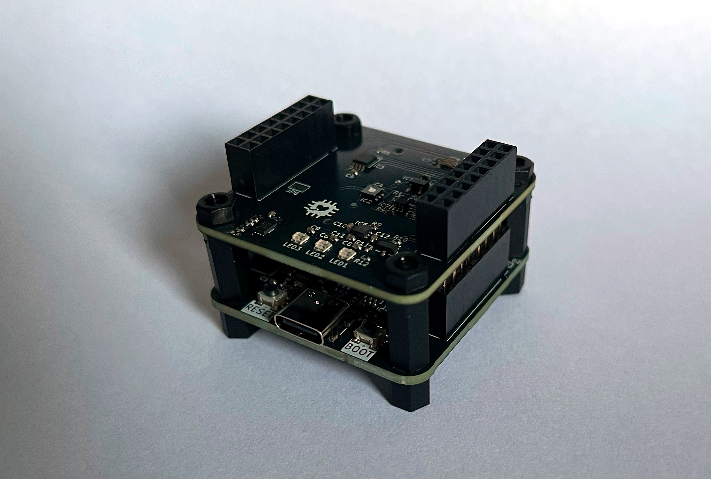
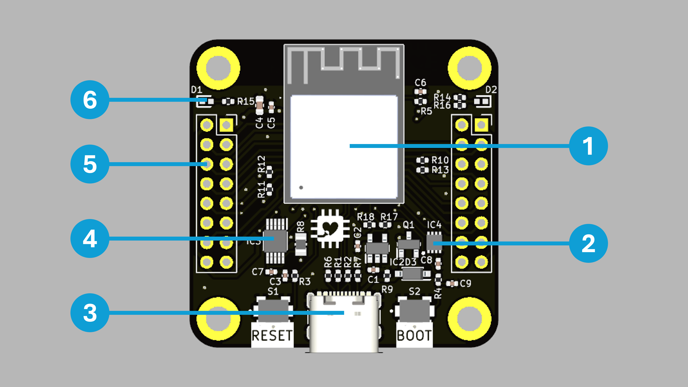
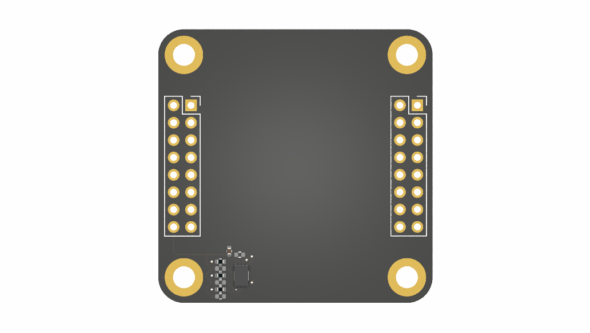
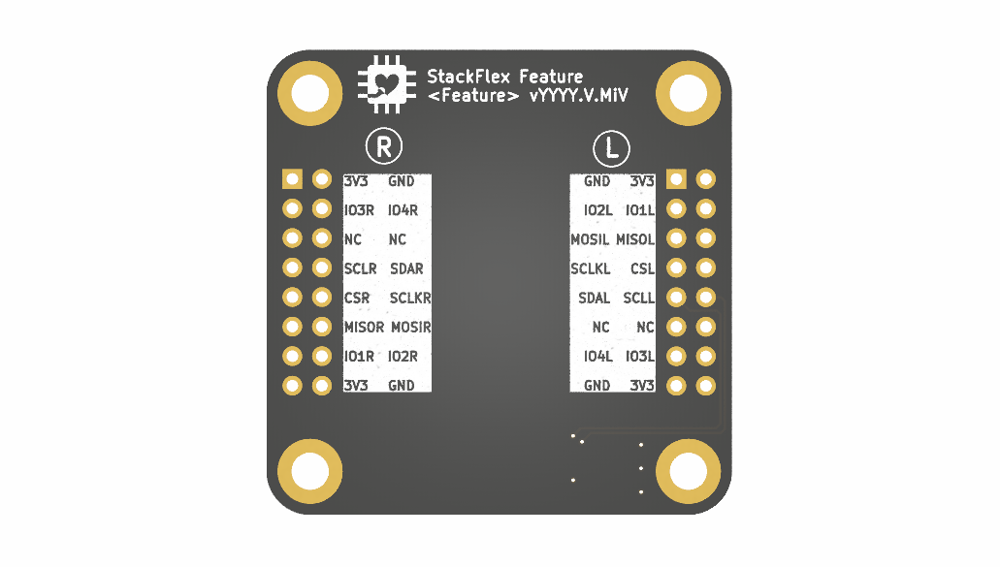

# What is StackFlex?

**StackFlex** is a microcontroller system built around the Espressif ESP32-S3 Mini module. The heart of the system is the **Core PCB**, which houses the microprocessor and supports power delivery via USB or a LiPo battery. Additional functionalities can be seamlessly integrated through modular **Feature PCBs**, which are designed to stack on top of the Core PCB.

The StackFlex system is highly extensible and flexible, all within a compact 40 mm x 40 mm form factor. Leveraging the advanced capabilities of the ESP32-S3 — such as Bluetooth LE, WiFi, and more — the innovative stacking mechanism, and templates for custom Feature PCBs, the system offers virtually unlimited use cases, constrained only by your imagination.

# Contents

- KiCad Projects
- PDF Schematics
- JLCPCB Production Files (Gerber, BOM, CPL)
- StackFlex Arduino Library *[tbd]* 

# Core PCB Highlights

1. **ESP32-S3 Mini 1 Module:** Powerful and energy-efficient microcontroller featuring dual-core processing, integrated WiFi and Bluetooth LE connectivity, AI acceleration, and extensive peripheral support.

2. **3.7 V LiPo:** Power StackFlex using a LiPo battery with state-of-charge (SOC) monitoring.

3. **USB C Connector:** State of the art connector to programm and power the microcontroller and its peripherals.

4. **LiPo Charging:** LiPo charges via USB if it is connected.

5. **Power Monitoring:** Monitor the power consumption and current of stacked Feature PCBs.

6. **GPIO:** Rotationally symmetrical GPIOs for enhanced flexibility.

7. **LEDs:** Two status LEDs (red, green)

=> Detailed documentation [here](/pcb/stackflex_core/).

# Feature PCBs

Feature PCBs enhance the fucntionality of the StackFlex system. Here is a list of already developed Feature PCBs:

- [Air Quality Feature PCB](/pcb/stackflex_feature_air_qual/)
    - Gas Sensor (TVOC, eCO2)
    - Temperature
    - Ambient Light Sensor
    - WS2812B Status LEDs
- more to come..

# Feature PCB Template

Develop and build your own Feature PCB with the provided KiCad Template Project.

=> Detailed documentation [here](/pcb/stackflex_feature_template/).
