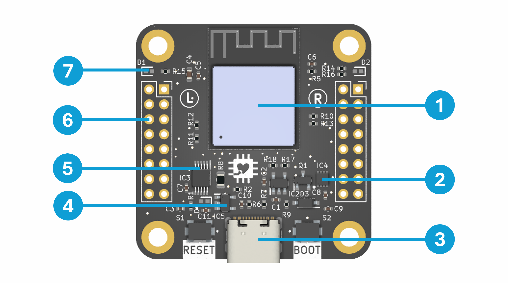

# What is StackFlex?

StackFlex is a microcontroller system based on the Expressif ESP32-S3 Mini module. 
The hearth of the system is the Core PCB with the microprocessor and power supply via USB or LiPo. Functionallities can be added by so called Feature PCBs, which can be stacked on top of the Core PCB. The StackFlex system is highly extendable and flexible at a very compact formfactor (40 mm x 40 mm). Due to the features of the ESP32-S3 (Bluetooth LE, WiFi, ..), the special stacking system and templates for custom feature PCBs, usecases are only limited by your imagination.

[System Image](misc/logo_white.png)

# Contents

- KiCad Projects
- PDF Schematics
- JLCPCB Production Files (Gerber, BOM, CPL)
- Documentation

# Core PCB Highlights

1. ESP32-S3 Mini 1 Module: ... 
2. 3.7 V LiPo SOC Analysis
3. USB C Connector
4. Current Monitoring for Feature PCBs
5. Rotationally symmetrical GPIO for even more flexibility
6. Two status LED

=> Detailed documentation [here](/pcb/stackflex_core/).

# Feature PCBs

- [Air Quality Feature PCB](/pcb/stackflex_feature_air_qual/)
    - Gas Sensor
    - Temperature + Humidity Sensor
    - Ambient Light Sensor
    - WS2812B Status LEDs
- more to come..

# Feature PCB Template

- ...

=> Detailed documentation [here](/pcb/stackflex_feature_template/).

# Ideation for v2

- LiPo Charging via USB

